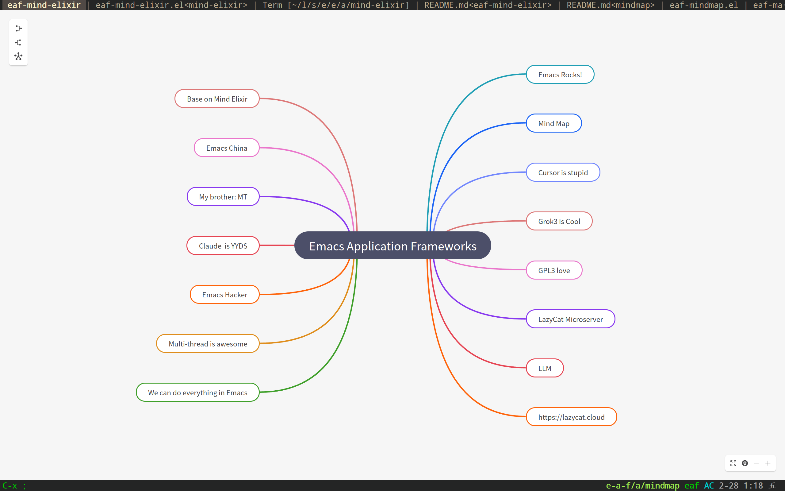

### EAF Mindmap
<p align="center">
  
</p>

Mindmap application for the [Emacs Application Framework](https://github.com/emacs-eaf/emacs-application-framework).

Base on [Mind Elixir](https://github.com/SSShooter/mind-elixir-core/)

### Load application

[Install EAF](https://github.com/emacs-eaf/emacs-application-framework#install) first, then add below code in your emacs config:

```Elisp
(add-to-list 'load-path "~/.emacs.d/site-lisp/emacs-application-framework/")
(require 'eaf)
(require 'eaf-mind-elixir)
```

### The keybinding of EAF Mind Elixir.

| Key   | Event   |
| :---- | :------ |
| `<f12>` | open_devtools |
| `M-r` | js_edit_current_topic |
| `M-f` | focus_root_node |
| `1` | save_file |
| `C--` | js_zoom_out |
| `C-=` | js_zoom_in |
| `C-0` | js_zoom_reset |
| `C-x C-y` | paste_to_node_topic |
| `C-x C-w` | copy_node_topic |
