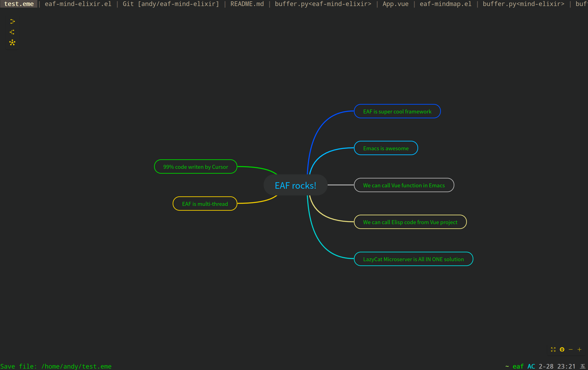

### EAF Mindmap
<p align="center">
  
</p>

Mindmap application for the [Emacs Application Framework](https://github.com/emacs-eaf/emacs-application-framework).

Base on [Mind Elixir](https://github.com/SSShooter/mind-elixir-core/)

### Load application

[Install EAF](https://github.com/emacs-eaf/emacs-application-framework#install) first, then add below code in your emacs config:

```Elisp
(add-to-list 'load-path "~/.emacs.d/site-lisp/emacs-application-framework/")
(require 'eaf)
(require 'eaf-mind-elixir)
```

